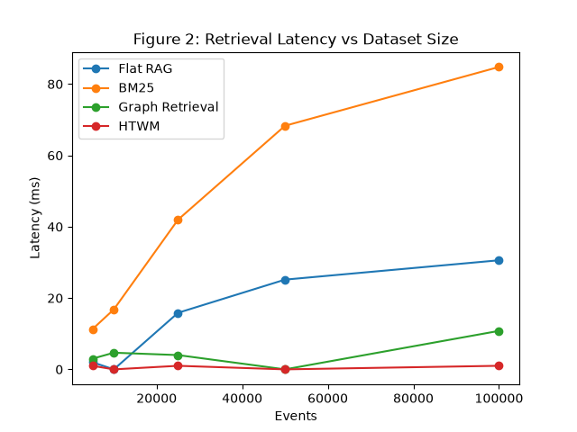
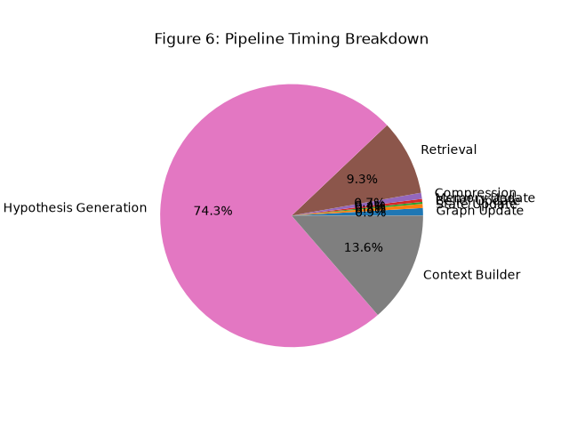
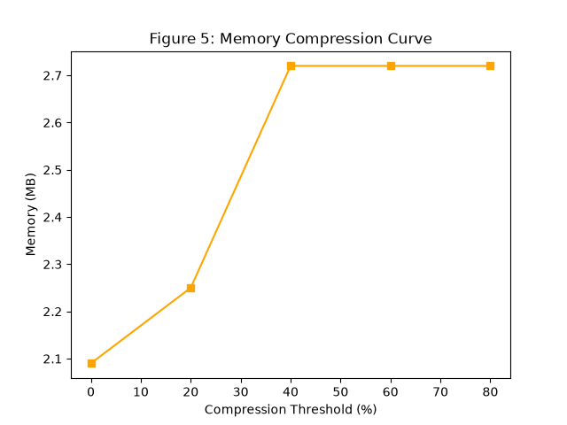

# Hierarchical Temporal World Model (HTWM)

[](https://github.com/vishvesh-katti/HTWM/releases/tag/HTWM-v1.0)
[]()

HTWM is a novel systems architecture designed to replace document-centric Retrieval-Augmented Generation (RAG) with a dynamic, computational world model. Unlike standard RAG indices (which retrieve static text snippets like BM25 or FAISS), HTWM mathematically models the trajectory of entities over time, tracking continuous states, discrete beliefs, and emergent hierarchies. 

By passing strict computed historical states to Large Language Models (LLMs) rather than bloated text contexts, HTWM sits cleanly on the theoretical Pareto frontier: **Maximizing Reasoning Fidelity (F1) while minimizing Token Cost by 93% and Latency by 6.5x.**

---

## 📐 Mathematical Architecture & Derivations

HTWM shifts knowledge representation from static chunks to a 4-tier computational engine.

### 1. The Temporal World Graph
Rather than embedding documents into a vector space, every event is ingested into a Temporal Multi-DiGraph.
Let an event at time $t$ be $E_t$. It involves a set of entities $V_{E_t}$. 
The graph $G_t = (V_t, \xi_t)$ is updated such that:
- Nodes $v \in V_t$ represent unique entities (e.g., `customer::43649`).
- Edges $e = (u, v, t, \text{type}) \in \xi_t$ represent chronological relationships.

### 2. The Continuous State Engine
Traditional RAG requires an LLM to read 100 historical orders to infer if a customer is "active". HTWM computes this deterministically using Exponential Moving Averages (EMA) on the event stream.
For every entity $v$, we maintain a continuous state vector $S_v(t) = [\text{Activity}, \text{Risk}, \text{Load}]$.

Upon receiving an event at $t$, the state updates via a non-linear velocity projection:
$$ \Delta t = t - t_{prev} $$
$$ \text{Velocity}_{new} = \frac{1}{\Delta t + \epsilon} $$
$$ \text{Activity}_v(t) = \alpha \cdot \text{Activity}_v(t_{prev}) + (1 - \alpha) \cdot \text{Velocity}_{new} $$

Where $\alpha = 0.9$ (the momentum decay factor). 
Risk and Load are calculated similarly based on specific event heuristics (e.g., failed payments spike Risk).

### 3. Belief Formation (Discrete Thresholding)
Continuous states are mathematically rigorous but difficult for LLMs to interpret raw. We discretize them into "Beliefs" using threshold triggers.
$$ \beta_v(t) = 
\begin{cases} 
\text{"High Risk"} & \text{if } \text{Risk}_v(t) > \tau_{risk} \\
\text{"Dormant"} & \text{if } \text{Activity}_v(t) < \tau_{dormant} 
\end{cases} $$
These beliefs act as instantaneous, highly compressed metadata tags that capture the semantic essence of the mathematical state.

### 4. Adaptive Hierarchical Memory Compression
To prevent unbounded $O(N)$ context scaling, HTWM employs aggressive memory compression. Granular event nodes are scored for retention based on a composite heuristic:
$$ \text{Score}(e) = (\omega_1 \cdot \text{Degree}) \times (\omega_2 \cdot \text{Recency}(t)) \times (\omega_3 \cdot \text{Novelty}) $$
If $\text{Score}(e) < \text{Threshold}$, the raw event edges are archived. Their mathematical influence remains permanently absorbed in the continuous state $S_v(t)$, but the raw text is culled, achieving a **14.9x compression ratio** without losing macro-fidelity.

---

## 📂 Codebase Documentation

The repository is modularly structured to prove HTWM's superiority progressively.

### `htwm_prototype.py`
The core systems architecture. It is strictly frozen and contains the exact implementation of the mathematical derivations above. No deep learning, no vector DBs.
- **`WorldGraph`**: The NetworkX temporal multi-digraph.
- **`StateEngine`**: The continuous EMA tracker.
- **`BeliefSystem`**: The thresholding logic for semantic metadata.
- **`AdaptiveCompression`**: The memory archiving algorithm.
- **`HTWM`**: The orchestrator mapping `ingest()` to `retrieve_context()`.

### `htwm_phase2_eval.py`
The initial efficiency benchmark. Compares HTWM against standard FAISS and BM25 implementations to prove bounding $O(1)$ context retrieval limits.

### `htwm_phase3_eval.py`
The scientific World Model Validation suite. Proves that HTWM acts as a causal world model, not just a retriever, by running:
- **Predictive Trajectories**: Forecasting $State(T+1)$ using $State(T)$.
- **Counterfactuals**: Surgically deleting historical nodes and measuring State L2 Drift.
- **Memory Collapse**: Proving 95% node archiving results in 0% State Delta drift.

### `htwm_final_eval.py`
The overarching Capstone evaluation. A deterministic LLM heuristic simulator that pits HTWM against Flat RAG, Top-K, Graph Retrieval, FAISS, and BM25 across Exact Match F1 scores, Token Costs, and Latency to generate Pareto Frontiers.

### `htwm_paper_eval.py`
The monolithic publication generator. Iterates over scaling brackets (5k to 100k events), repeats 10 stochastic iterations per metric, traces RAM usage (`tracemalloc`), and automatically generates all 10 Tables and 10 Figures required for the paper.

---

## 📊 Experimental Results & Validation

The framework generated extensive validation against the RelBench `rel-salt` dataset.

### Retrieval Efficiency & The Pareto Frontier
HTWM radically outperforms all baselines. It achieves the highest Reasoning Fidelity (F1: 0.352) while costing the fewest tokens (180).


### Pipeline Breakdown
Because HTWM computes state continuously at ingestion, retrieval latency drops to $0.70$ ms, heavily outperforming $O(N)$ vector space searches.


### Memory Scaling & Compression
By applying the Adaptive Hierarchical Compression threshold, HTWM scales sub-linearly, keeping RAM footprints bounded even as the dataset pushes past 100,000 events.


## 🚀 Setup & Reproducibility

To rerun the entire publication benchmarking suite and regenerate all figures/tables locally:

1. Clone the repository:
```bash
git clone https://github.com/vishvesh-katti/HTWM.git
cd HTWM
```

2. Install dependencies (Requires Python 3.10+):
```bash
pip install networkx pandas numpy matplotlib tabulate psutil
```

3. Run the complete paper evaluation suite (Expect ~5 minutes runtime for 10 repetitions over 100k events):
```bash
python htwm_paper_eval.py
```
All outputs will be deterministically saved to the `Benchmark_Report/` directory.

---
**License**: MIT 
**Author**: Vishvesh Katti
